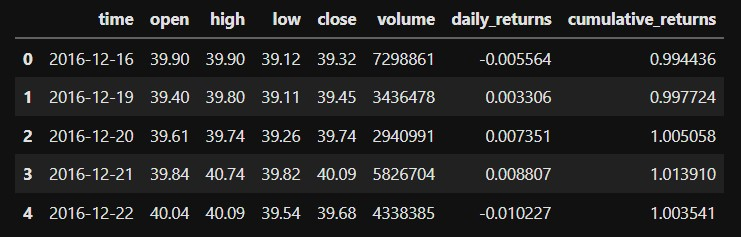
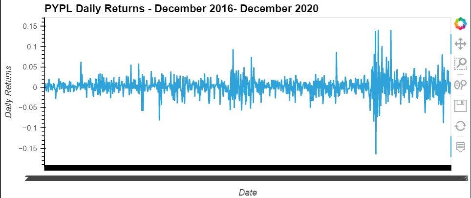
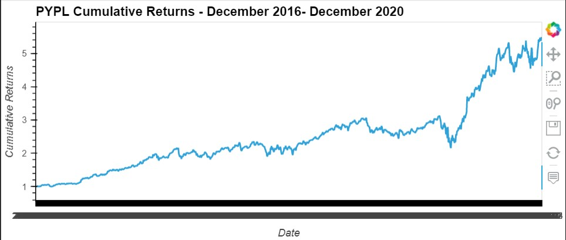
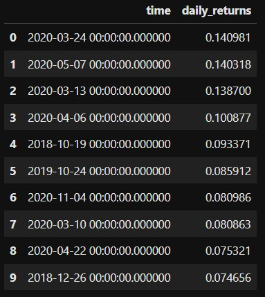
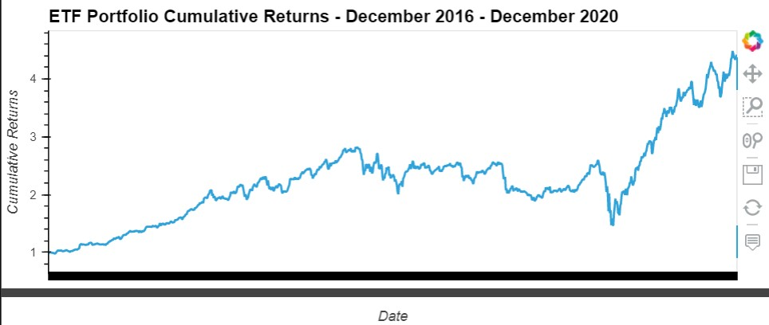
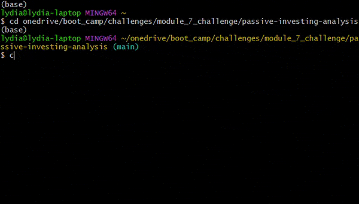
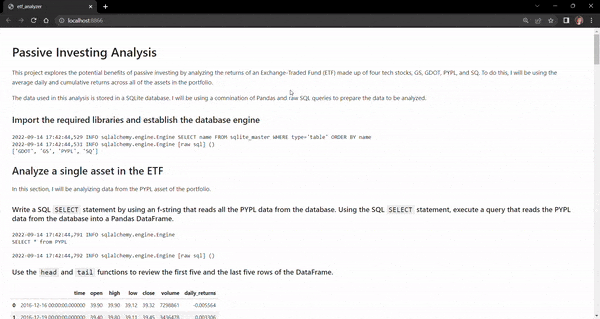

# Passive Investing Analysis

## Overview and Purpose
This project explores the potential benefits of passive investing by analyzing the returns of an Exchange-Traded Fund (ETF) made up of four tech stocks: GS, GDOT, PYPL, and SQ. To do this, I created DataFrames and visualizations of the average daily and cumulative returns across all of the assets in the portfolio.

The data used in this analysis is stored in a SQLite database. I will be using a comnination of Pandas and raw SQL queries to prepare the data to be analyzed. This project is the weekly challenge for week 7 of the UW Fintech Boot Camp: Financial Databases with SQL.

The purpose of this project is to demonstrate the use of SQL and Python together to access and manipulate data stored in a SQL database.

## Process
This project has two main sections. The first section consists of performing an analysis on a single asset in the ETF, PYPL. The second section focuses on analyzing the portfolio as a whole.

### Establishing the Database

After importing the required libraries, I established the database engine that I would need to execute queries. The data comes from the database file `etf.db`.

```
database_connection_string = 'sqlite:///etf.db'

engine = sql.create_engine(database_connection_string, echo=True)

sql.inspect(engine).get_table_names()
```

### Analyzing an Individual Asset
In order to perform analysis on the data from the `PYPL` table, I used a SQL query to read the data from the table into a DataFrame.
```
query = """
SELECT * from PYPL
"""

pypl_dataframe = pd.read_sql_query(query, con=engine)
```
The following image shows the first five rows of the PYPL DataFrame:



From here, I created two interactive visualizations for the daily returns and cumulative returns of PYPL.





I also used SQL to select the top 10 returns for PYPL from the dataset.

```
query = """
SELECT time, daily_returns FROM PYPL
ORDER BY daily_returns DESC
LIMIT 10;
"""

pypl_top_10_returns = pd.read_sql_query(query, con=engine)

pypl_top_10_returns
```



### Analyzing the Full Portfolio
In order to analyze the ETF portfolio as a whole, I needed to read all of the assets into a single DataFrame. To do this, I performed a SQL inner join on the `time` column for each table.
```
query = """
SELECT * FROM GS
INNER JOIN GDOT ON GS.time = GDOT.time
INNER JOIN PYPL ON GS.time = PYPL.time
INNER JOIN SQ ON GS.time = SQ.time;
"""

etf_portfolio = pd.read_sql_query(query, con=engine)
```
Using this combined DataFrame, I calculated and plotted the average cumulative returns for the full portfolio.



### Deploying the Notebook as a Web Application
For this challenge, we were asked to use the Python library Voila to deploy our notebook as an interactive web application. To deploy this application locally, I launched it from the command line by navigating to directory containing the notebook, activating Anaconda, and entering the command to launch Voila.






---

## Technologies

* Python 3.9
* SQL, SQLite
* Python libraries: Numpy, Pandas, Holoviews, SQLAlchemy, Voila
* Jupyter Lab and Jupyter Notebooks

---

## Contributors
Lydia Ciummo - lydiaciummo@hotmail.com

---

## License
GNU General Public License v3.0